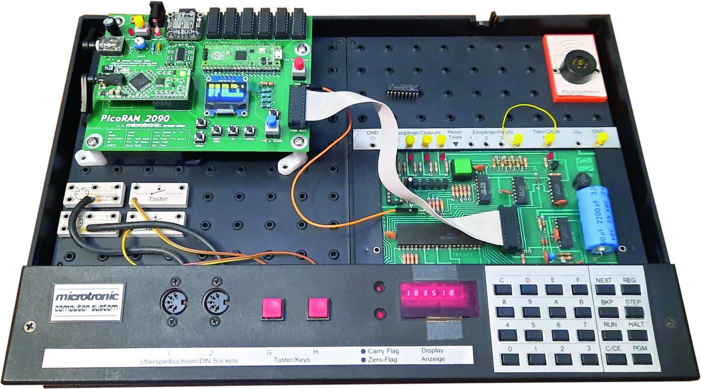
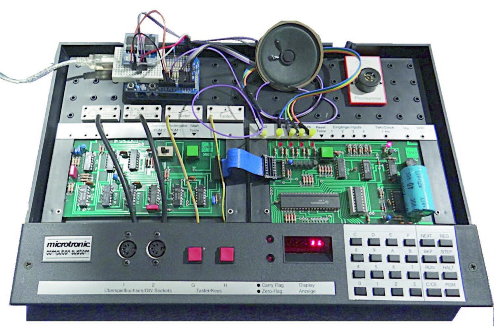
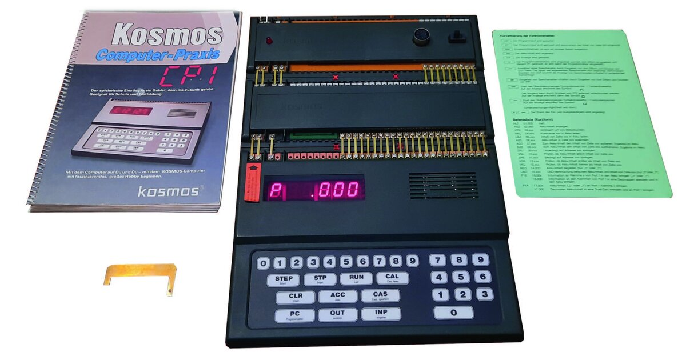
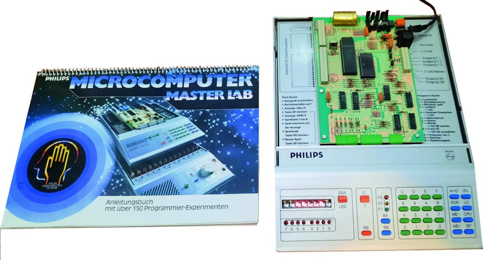
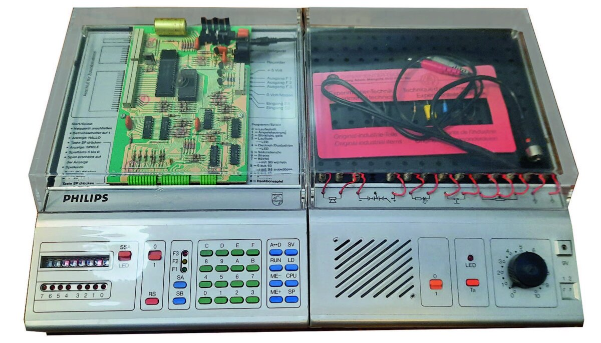
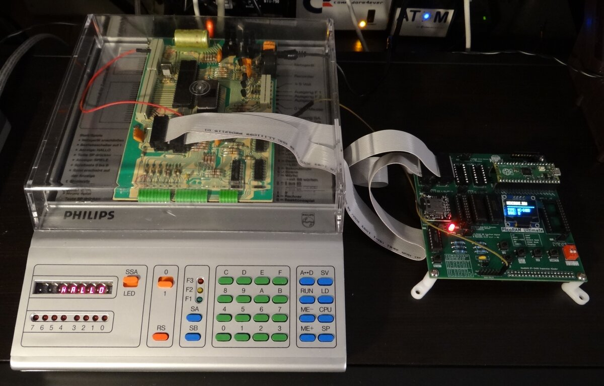
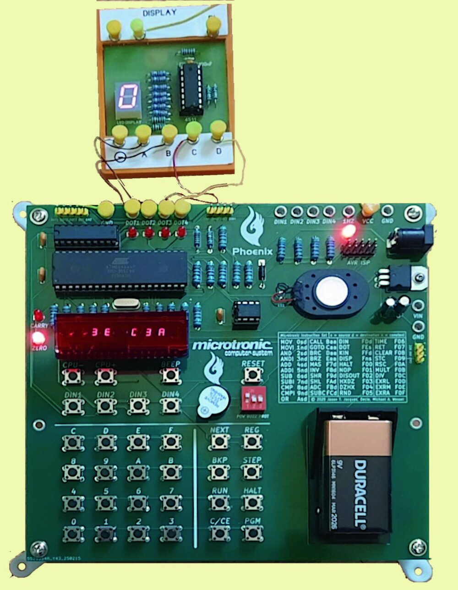

# Educational Computers in Germany in the 1980s

### The Busch Microtronic, the Kosmos CP1, and the Philips MasterLab

*Original German articles by **Michael Wessel**, published in LOAD #10 (2024) [8] and
LOAD #11 (2025) [9] — the magazine of the VzEkC e.V. English translation and combined
edition by **Claude (Anthropic, Opus 4.8)**.*

> This is a revised, all-in-one English edition that merges the two original LOAD articles
> into a single piece. It also incorporates recent developments (2025–2026) that were not
> yet available when the German originals were written.
>
> A print-ready PDF (US Letter) is
> [included in this repository](educational-computers-in-germany-in-the-1980s.pdf).
> The faithful, unmerged per-article translations are under [`translations/`](translations/).
> Citations in square brackets [N] refer to the numbered [References](#references).

---

## Introduction

In the early 1980s a new home-computer category appeared on the already nearly saturated
German market: the **educational and experimentation computer** (*Lern- und
Experimentiercomputer*). When, at the end of 1981, the first such machine for
"technically interested laypeople" appeared in German department stores — the Busch 2090
Microtronic — 8-bit home computers were already widespread in Germany. Worth mentioning
in particular are the representatives of the "Trinity" (Apple II, TRS-80, Commodore PET),
but also the VC-20, Atari 400 and 800, Sharp MZ-80, Sinclair ZX80 and ZX81, and the Texas
Instruments TI-99/4a. There was thus no shortage of home computers — so why a new device
category? And what distinguishes such a computer from a classic CPU development system or
a CPU trainer?

**Predecessors.** Well-known representatives of the trainer category include the KIM-1
(1976, 6502-based, MOS Technology) and the MK-14 (1978, Science of Cambridge, SC/MP /
INS8060 CPU). In the USA the COSMAC ELF (RCA 1802) and the Heathkit ET-3400 trainer
(Motorola 6800) had been around since 1976, and there were various self-build projects in
the relevant computer magazines. It can be assumed, though it is not documented, that
these CPU trainers at least inspired the German educational computers. Jörg Vallen — who
from autumn 1979 was substantially involved in developing the Microtronic as part of his
diploma thesis — summed up the need for a new category in the preamble of his thesis [3]:

> "At the time development of an experimentation and educational computer began, in autumn
> 1979, microcomputers of this kind were hardly to be found on the market. There were as
> yet no devices that enabled non-specialists to familiarize themselves with
> microprocessor technology. (…) Only so-called development systems were offered by the
> large semiconductor manufacturers, in order to give engineers with appropriate training
> the opportunity to learn the workings of a particular microprocessor type. Accordingly,
> these systems were designed from the electronic side. The manuals and descriptions
> written by specialists were (and largely still are today) incomprehensible to
> non-specialists without basic knowledge."

Later, Hans Vallen — then head of the Busch company and father of Jörg Vallen — used the
term "computer driving school" to characterize the Microtronic [6]. So what defines an
educational and experimentation computer? Four points stand out:

- **Educational focus.** The target group is "interested laypeople", and children and
  teenagers in particular. The manuals especially must therefore be designed with a
  certain didactic standard — many classic CPU trainers are inadequate here, and many were
  only available as kits. The educational angle surely also convinced some parents that an
  educational computer was a better buy than a BASIC home computer used mainly for games
  (which would moreover compete for the family television set).
- **Experimentation focus.** The aim is not only to learn programming, but also to combine
  it with experiments on electronic circuits ("physical computing"). General-purpose
  input/output ports (GPIOs) are therefore required — ideally robust against miswiring, to
  enable "worry-free experimentation". Today one would use an Arduino for this; in
  contrast, the educational computers of the 1980s were complete systems that needed no
  additional "PC" for programming.
- **Cost.** A "real" BASIC home computer was an expensive barrier to entry. With the
  exception of the Sinclair ZX80/81, these still cost around DM 700 and up, plus
  peripherals, software and books — and that only changed with the price collapse of 1984.
  By contrast, the Microtronic was advertised in 1981 [7] at DM 379, falling to DM 299 by
  1984. For comparison: a VC-20 still cost DM 798 at the end of 1981 — a full week's
  salary, given an average German annual income of DM 30,900.
- **Availability.** CPU trainers were hard for ordinary consumers to obtain — often
  kit-only and known only to readers of electronics and amateur-radio magazines.
  Department stores did not carry them. The educational computers, by contrast, were sold
  where families actually shopped.

German educational computers are a fascinating and magnificent piece of technical history
that did not exist in this form in other countries.

## Outline

This article presents three representatives of the German educational/experimentation
category, **in historical order**, each in its own section:

1. the **Busch Microtronic** (1981) — a 4-bit TMS1600-based machine with a remarkably
   terse and powerful interpreted instruction set;
2. the **Kosmos CP1** (1983) — an 8-bit Intel 8049-based decimal von-Neumann machine with
   an unusually rich set of GPIOs;
3. the **Philips MasterLab** (1983) — an INS8070 (SC/MP III)-based machine that is, of the
   three, the only "real" CPU trainer.

A comparison and an overall conclusion follow at the end.

---

## 1. The Busch Microtronic (1981)

*Figure 1. The Busch Microtronic, shown with the modern PicoRAM 2090 SD-card expansion [14].*

Busch electronics kits had been available in Germany since 1976; until October 1981 they
were distributed under the name "ELOtronic" by the Franzis publishing house. The
Microtronic was conceived as the complement and flagship of the Busch electronics-kit
series. Its appearance can be called elegant and high-quality — the case and build make a
sturdy impression, the smoked-glass cover looks professional, and the keyboard allows even
longer program entry without frustration, in no way inferior to the TI calculator
keyboards of the era (TI-30, TI-58/59).

The heart of the Microtronic is a mask-programmed **TMS1600 4-bit microcontroller, clocked
at 500 kHz**. The firmware contains the operating system and an interpreter for a virtual
machine language. The Microtronic is therefore programmed not in TMS1600 machine language,
but in a higher-level Microtronic machine language — easier to learn, and offering very
powerful instructions, for example for multiplication and division.

**Development.** Development work began in autumn 1979. The hardware and operating system
were carried out, to Busch's specifications, by the company "MRT – Mess- und Regeltechnik"
in Kaisersbach (now insolvent); Jörg Vallen worked there directly as part of his thesis
and made essential contributions. Texas Instruments in Freising took over production of
the mask-programmed TMS1600. The instruction set, originally 20 instructions, was expanded
to 41 in the second development phase — again with Jörg Vallen instrumental: as the first
application developer, following "eat your own dog food!", he identified deficits and
further desirable instructions (random numbers, multiplication, division). The thesis [3]
also reveals that originally a TMS1xxx development system with EPROMs was used (possibly an
HE-2), and that the finished operating system was handed over to TI "on a floppy disk". As
program memory, the developers connected a 2114 SRAM chip via the TMS1600 "GPIO port" —
although the TMS family, as a "computer on a chip", provides for no external memory at all.
The 1 KByte of 4-bit words of the 2114 is used as program memory; the SRAM on the TMS1600
holds the 32 4-bit Microtronic registers and monitor variables.

**Harvard architecture.** The program memory comprises 256 addresses (0x00–0xFF), and each
instruction is three nibbles (12 bits). Program and data memory are strictly separated: as
program-writable data memory the Microtronic offers exclusively the registers (plus
immediate-addressing instructions). Of the 32 registers, 16 are working and the rest
background registers, swappable in banks of 8 so that data can be transferred between
foreground and background. All logical-arithmetic operations and data must fit into these
32 4-bit registers. The hexadecimal number system is used; the hex keypad has eight
function keys, and the display is a six-digit seven-segment "bubble LED" display (as in old
TI calculators), with two LEDs for the carry and zero flags. A green reset key is on the
board — and the program memory survives a reset. A DIL expansion socket connects the "2095"
cassette interface; four digital outputs, four digital inputs, and a 1 Hz clock signal are
brought out as plug sockets.

**Built-in programs.** On power-up the monitor shows "00 000" — address on the left,
instruction on the right (both hex). RUN starts at the current address; the monitor offers
single-step (STEP) and breakpoints (BRK), and register inspection/editing via REG. PGM
calls built-in programs: cassette load/save (PGM 1/2), the NIM game (PGM 7), clear memory
(PGM 5), self-test (PGM 0), and display/set the (non-battery-backed) real-time clock
(PGM 3/4). PGM 6 fills memory with NOPs.

**Instruction set.** The instruction set is terse, pragmatic and must be called extremely
well-designed. It includes instructions to control the display (showing up to six
consecutive registers), keyboard input, GPIO, random numbers, time-of-day queries,
logical-arithmetic and bitwise operations, and hex/decimal conversion. Most operations can
be performed equally in all registers — the set is very orthogonal, similar to modern RISC
CPUs. The carry flag combines arbitrary 4-bit registers into larger ones, so addition and
subtraction can run up to 64 bits (division is limited to four, multiplication to six
digits). Set flags trigger conditional jumps. Subroutines exist (CALL/RET) but cannot be
nested. The biggest shortcoming is that only two addressing modes are supported (immediate
and register-direct); jump targets are always immediate, so they cannot be computed —
indirect and computed jumps, and thus recursion, require relatively complicated trickery.
(The author nonetheless succeeded in implementing a recursive Towers of Hanoi on the
Microtronic [10].) None of this harms the overall impression of a universal computer; the
manual programs are throughout quite general — the NIM game actually computes the optimal
winning strategy. Interpreting the instruction set costs time, though: a typical maximum is
about 114 instructions per second, dropping to about 40 with the display on; some programs
(e.g. dividing 9999 by 1) take up to 8 seconds.

**Manual.** The two-volume manual [1], written by Jörg Vallen and lovingly illustrated with
the "Buschi" mascot, is didactically excellent: Part 1 introduces the Microtronic, Part 2
covers more complex programs, circuits and experiments with additional Busch kits.
Highlights include a moon-landing game, a perpetual calendar, biorhythm calculation, a
calculator, tic-tac-toe and sine computation; the electronics section covers timers,
tone/music generators, model-railway control, a frequency counter and a reaction-time
meter. An English translation of this classic manual (Part 1) is now underway [2], making
it accessible to a wider, non-German-speaking audience. A clever **trick** works around the
low ~3–4 Hz GPIO sampling rate: input 4 clocks the firmware's background real-time clock,
which can register frequencies up to 60 Hz, so externally generated pulses are counted
automatically and read out via the "get-time" instruction (F06).

**Extensions, old and new.** The original "2095" cassette interface is leisurely (a full
dump takes ~220 s ≈ 14 baud); the "2092 special interface" doubles the GPIOs and adds
relay-driving transistors (e.g. for Fischertechnik robots). There is no dedicated expansion
bus — everything goes through the normal GPIOs. Modern extensions by the author include an
Arduino-based speech synthesizer and a [2095 SD-card emulator](https://github.com/lambdamikel/microtronic-2095-arduino-emulator) [15]
(building on Martin Sauter's 2017 protocol decode), and especially
[**PicoRAM 2090**](https://github.com/lambdamikel/picoram2090) [14], a Raspberry Pico-based
RAM emulator with SD card that replaces the 2114, adds bank-switched memory expansion and an
extensive I/O expansion (speech, sound, OLED text/graphics, battery-backed clock). It is
addressed through 64 "redundant", ineffective instructions (such as `MOV <x> → <x>`, a
NOP-like register-to-self copy) that never occur in normal programs; PicoRAM repurposes
them as new side effects. PicoRAM 2090 won the RetroChallenge 2023/10 Grand Prize. A range
of emulators also exists — the first written by the author in 1985 on a Schneider CPC 464 in
BASIC; a [C/Linux emulator](https://freeshell.de/~d01c/micsim_0.1.0.tar.xz) by Ingo D.
Rullhusen [32]; a [Macintosh app](https://download.cnet.com/2090-emulator/3000-2072_4-47314.html)
by Stephan Kleinert [33]; and
[Arduino-based hardware emulators](https://github.com/lambdamikel/Busch-2090) [13] from 2016
onward, including the "Microtronic 2nd / Next Generation" re-editions built into a Busch
"2070" console (Hackaday "Reinvented Retro Contest" winner, 2021).

*Figure 2. The Busch Microtronic with the original 2095 cassette interface and a DIY speech synthesizer.*

**Recent developments (2025–2026).** The author has also used the Microtronic as the brain
of larger systems: a recursive [Towers of Hanoi](https://github.com/lambdamikel/towers-of-hanoi) [10]
solver drives a physical pan/tilt **Hanoi robot** and, most recently, animates the solution
on a **64×32 RGB LED matrix** — via a microcontroller that reads the Microtronic's moves
over a simple 4-bit GPIO protocol (a video of the recursive solver running on the
Microtronic is available [37]). And, most significantly of all, the original Microtronic
firmware ROM was finally recovered and brought back to life on new hardware: the
[**Microtronic Phoenix**](https://github.com/lambdamikel/microtronic-phoenix) [16],
described in the appendix.

**Björn Rathje's projects.** The most ambitious and impressive *contemporary software*
projects for the Microtronic — the author's own Towers of Hanoi notwithstanding ;-) — come
from [**Björn Rathje**](https://github.com/rab-berlin) [20]. Working purely in the
Microtronic's tiny 256-instruction machine language, he has produced a remarkable body of
work that pushes the little 4-bit machine far beyond what its 1981 manuals imagined:

- [**Monarch2090**](https://github.com/rab-berlin/Monarch2090) [21] — a faithful simulation
  of the legendary *Rotomat Monarch* (1972) slot machine on the Microtronic; the standout
  piece, and the most elaborate.
- [**Kniffel2090**](https://github.com/rab-berlin/Kniffel2090) — Yahtzee (Kniffel) for the
  Microtronic.
- [**Mensch2090**](https://github.com/rab-berlin/Mensch2090) — "Mensch ärgere dich nicht"
  (the German Ludo / "Sorry!"-style board game).
- [**Invaders2090**](https://github.com/rab-berlin/Invaders2090) — Space Invaders on the
  Microtronic.
- [**Life2090**](https://github.com/rab-berlin/Life2090) — Conway's Game of Life.
- [**BerlinUhr2090**](https://github.com/rab-berlin/BerlinUhr2090) — the Berlin "set-theory
  clock" (Mengenlehre-Uhr) rendered on the Microtronic.
- [**Film2090**](https://github.com/rab-berlin/Film2090) — "the Microtronic goes to
  Hollywood": a playful animation/film project.
- [**ESP2090**](https://github.com/rab-berlin/ESP2090) — a modern take pairing the
  Microtronic world with an ESP32 and MicroPython.

That a 4-bit, 500 kHz machine with 1 KB of program memory can host a slot-machine
simulation, several board and arcade games, and Game of Life is a testament both to the
elegance of the Microtronic instruction set and to Rathje's ingenuity.

---

## 2. The Kosmos CP1 (1983)

*Figure 3. The Kosmos CP1, with its spiral-bound manual and the green quick-reference card.*

The Kosmos CP1 was released in 1983 at an introductory price of DM 198, as a complement to
Kosmos electronics kits (for example the "Elektronik Labor" sets): a Kosmos breadboard with
the typical clamp contacts can be attached to it, and cables for the screw terminals at the
back screw on directly. Its appearance is modern — the membrane keyboard and the large
six-digit seven-segment display catch the eye, and it is immediately clear that exclusively
the **decimal** number system is used (the hex digits A–F are nowhere to be found; the
digit keys are even duplicated). The case is shapely but the build quality does not fully
convince (thin plastic, a thick-cardboard base, and these days a strong flux smell). The
membrane keyboard does not allow "blind" typing — there is no haptic pressure point — and
the duplicated digit keys are, in the author's opinion, a waste of space; the CAL key sits
unfortunately close to INP, causing frequent accidental activations.

**Processor.** The heart of the CP1 is a mask-programmed **Intel 8049**, accompanied by an
8155 serving as 2 KByte 8-bit SRAM and for I/O. (Some units use the non-mask-programmed
8749 with an external EPROM instead — possibly early versions.) The 8049 is clocked at
6 MHz. Notably, the foreword of the manual [4] was written by Prof. Karl Steinbuch, a
prominent information-processing professor at the University of Karlsruhe, though his
influence on the design is not documented. The CP1 is not programmed in the
microcontroller's machine language (MCS-48) but in a virtual machine language executed by
an interpreter; the 2 KB firmware contains the interpreter, the monitor and a few built-in
programs.

**Architecture.** The CP1 is laid out as a strict, almost academic **decimal von-Neumann
machine**. The only register is an accumulator; all operations to and from memory must pass
through this "von-Neumann bottleneck". The base version offers 128 memory cells (program and
data); the CP3 expansion raises this to 256. All data, instructions and addresses are
encoded in decimal. Cells hold values from "00.000" to "24.255": for a cell "xy.abc", "xy"
is the instruction code (01.–24.) and "abc" the operand or address (0–255); data cells use
"00.abc". A separate decimal 8-bit I/O pointer (EAZ), shown via "9 OUT", is used for
entering and inspecting cells (entries via "IN"/Enter auto-increment it). There is no
breakpoint facility — one inserts HALT manually. The decimal scheme and the cumbersome
"9 OUT" mechanism are ergonomically inferior to what hexadecimal would have afforded.

**Instruction set.** Instructions exist to display and delay, to load the accumulator with a
constant or a cell and store it back, and to add/subtract a cell. An "implicit" flag is set
by comparing the accumulator with a cell (equal/less/greater), after which a conditional
(or unconditional) jump can run. A binary (0/1) accumulator can be negated and AND-ed with
a binary cell; there are no bitwise operations. A loaded cell brings in both the operand
"abc" *and* the opcode "xy."; performing arithmetic on a cell that actually holds an
instruction (xy. ≠ 00) aborts the program with "F 002".

**Strengths and weaknesses.** A real strength is **indirect loading/storing** of the
accumulator — like pointer variables in C — enabling lists, stacks and arrays, plus
**indirect jumps** that make return stacks, nested subroutine calls, recursion, and even
self-modifying and relocating programs possible. (Amusingly, the manual's relocation
program only works in restricted cases — because of indirect addressing, program relocation
is in general undecidable.) Against this, much is missed: I/O is limited (the display only
shows the accumulator; the keyboard cannot be read by programs — external metal-bracket
buttons serve instead), and there are no multiply/divide, random-number, or bitwise
instructions. The accumulator must not over- or underflow (>255 or <0 aborts with "F 006",
and there is no carry flag) — but here the decimal system becomes a stroke of genius:
"greater than 99" comparisons let several cells be combined into arbitrarily wide
registers, since 2 × 99 < 255. The instruction set is not terse: the strict von-Neumann
model means almost every operation is load → manipulate → store, tripling the instruction
count and quickly exhausting memory. The CP1 thus illustrates the von-Neumann bottleneck
excellently (though the manual does not address this). It is, however, considerably faster
than the Microtronic — the interpreter runs at about **3200 instructions/second**, nearly
30× the Microtronic — which matters for the GPIOs.

**GPIOs and extensions.** The CP1's large number of GPIOs is a clear strength: the base
version already has an 8-bit input/output plus an 8-bit output, and the CP3 expansion adds a
second 8-bit input/output and two further outputs (8 and 6 bits). Unlike the Microtronic, the
CP1 has a dedicated expansion bus: the CP2 cassette interface, the CP3 memory/port
expansion, the CP4 relay module (model railways, Fischertechnik robots) and the CP5
(eight LEDs + amplifiers on output 2, eight slide switches on input 1) can all be combined.
The manual [4] is lovingly and didactically high-quality, using the "Computron" character to
carry out the CPU operations; its programs resemble the Microtronic's (NIM, moon landing,
dice, Senso, number guessing) and kit-based projects (timers, reaction testers, blinking
lights, tone generators, alarms, model-railway control). Compared with the Microtronic,
some programs are less general — e.g. the CP1's NIM is hard-coded for 15 sticks / 3 removable
and uses external buttons for input, since the keyboard cannot be read by programs. Both
software and hardware (Arduino-based) emulations and re-implementations exist; since the
firmware is available and the parts are standard, faithful re-implementations are easy
(e.g. [MiniPC](https://www.g-heinrichs.de/wordpress/index.php/informatik/minipc/) [26]
emulates the 8049 and runs the original firmware, while a
[Java-based emulator](https://sourceforge.net/projects/cp1-sim/) [27] reimplements the
virtual machine directly), and an
[Arduino-based CP2 cassette emulator](https://github.com/asig/kosmos_tape_emulator) [23] has
been developed. Further background on the CP1 is collected at the
[8-bit Home Computer Museum](http://www.8bit-homecomputermuseum.at/computer/kosmos_computer_praxis_cp1.html) [28].

**Recent developments (2025–2026).** The same recursive Towers of Hanoi also runs on the
CP1, which can likewise drive the 64×32 LED-matrix renderer. To make writing and loading
CP1 programs painless, the author built a small
[**CP1 development toolchain**](https://github.com/lambdamikel/kosmos-cp1-devel-toolchain) [11]:
a real assembler (mnemonics, labels), and — after digitizing a genuine CP2 cassette save and
reverse-engineering the previously undocumented CP1/CP2 FSK tape format — a tool that turns
a program into a **cassette WAV** you simply play into the CP2, so programs load without any
hand-keying (a video of the recursive Towers of Hanoi running on the CP1 is available [38]).
This builds on a lively CP1 community — the
[asig/kosmos-cp1](https://github.com/asig/kosmos-cp1) [22] emulator (with an integrated
assembler and an SD-card tape emulator), the
[RalphBln cassette emulator](https://github.com/RalphBln/kosmos-cp1-arduino-cassette-emulator) [24],
and the [moosy CP1 toolchain](https://github.com/moosy/kosmos-cp1-toolchain) [25] are all
valuable companions.

---

## 3. The Philips MasterLab (1983)

*Figure 4. The Philips MasterLab and its "Microcomputer Master Lab" manual.*

Philips was at the time probably the second-largest supplier of experimentation kits on the
German market, behind the leader Kosmos. In 1983 the MasterLab came out under the Philips
label for DM 449.00, as part of the new "6000" ("ABC") series; from 1984 Philips withdrew
from the kit market and the series continued under the Schuco name (the takeover by the
Mangold Group — Schuco, Trix, GAMA — had been decided in 1982). The 6000 kits, and thus the
MasterLab, had been developed by Philips's educational-materials department together with
the "Institut für Lehrerfortbildung" (Institute for Teacher Training) in Hamburg — in
particular by Mr. Erhard Meyer, author of the manual [5], whose initials "E.M." also appear
in the firmware EPROM ("COPYRIGHT 1982,1983 (C) GAMA, E.M., …"). What seems certain is that
the MasterLab's birthplace lies in Hamburg; more on its origins is collected on the
[Philips/Schuco 6400 information page](https://norbert.old.no/kits/6400/6400.html) [30].

**External attributes.** The MasterLab is a feast for the eyes — a shapely silver case with
a transparent Plexiglas hood, colorful keys, and a seven-segment LED display of **eight**
digits instead of six. A row of eight LEDs sits below the display, with three further LEDs
(F1, F2, F3) and two input buttons (SA, SB); an SSA/LED switch toggles the display between
seven-segment mode and the eight LEDs (driven by the middle digit's 7+1 segments). It even
has an on/off switch and a reset button — neither of which the Microtronic or CP1 has — plus
eight function keys for the monitor.

**An unusual CPU.** The board carries an **INS8070 (SC/MP III) CPU clocked at 4 MHz**. As in
the Microtronic, a 2114 SRAM (here doubled, for 8 bits) provides 1 KB at 0x1000–0x13FF, with
the firmware in a 4 KB (2732) EPROM up to 0x0FFF. Unlike the Microtronic and CP1, which run
an interpreted higher-level language, the MasterLab is programmed **directly in INS8070
machine language** — it is therefore more a classic CPU trainer than an "educational
computer", and consequently far faster: the author measured **147,050 instructions/second**,
making it roughly 1,290× the Microtronic and about 46× the CP1 (see the benchmark below). On
power-up the monitor shows a friendly "HALLO" — making clear the display is good for more
than hex; in fact every segment of every digit can be addressed individually (as the
scrolling-text demo shows).

**Button-controlled GPIOs.** The buttons SA, SB and LEDs F1, F2, F3 are the GPIOs, brought
out as a header and transistor-buffered — so the MasterLab offers only three digital outputs
and two digital inputs (somewhat meager). Their connection is elegant, though: they are
controlled **directly by the INS8070's flag/status register**, needing no firmware support,
and SA/SB can even trigger interrupts — making them about two orders of magnitude faster than
the CP1's. Unlike the others, the MasterLab has a built-in cassette interface, realized
almost entirely in software: the fast I/O lets the CPU both generate the 1/2 kHz cassette
tones and read them back via the SB input, observing the pulses directly in the status
register. An expansion bus on the left brings out address, data and control buses (a RAM
expansion would be easy); expansion boards were apparently envisioned but never released.

**Firmware, manual and capabilities.** The firmware holds demo programs (siren, lottery
numbers, calculator, scrolling text, digital clock, traffic-light control on the F-LEDs,
dice, …), started via the SP key; the monitor resembles comparable trainers (e.g. the
Multitech MPF-1), with A/D for address/data, ME+/ME- to step the address, SV/LD for
cassette, and CPU to inspect/modify registers ("CPU 6" = accumulator, "CPU 0" = PC).
Breakpoints and single-step are absent, but a HALT can be inserted manually. The manual [5]
is a deep, comprehensive introduction to INS8070 programming — the CPU even offers 16-bit
operations (the multiply combines A and E into a 16-bit register multiplied by the 16-bit T
register, giving a 32-bit A,E,T result; a divide exists too), a stack pointer, two pointer
registers (SP1, SP2) for indexed addressing, interrupts, and a wealth of addressing modes
(immediate, absolute, implied, direct, indirect, indexed, relative). Firmware CALL routines
ease programming (display control, 2-/4-digit hex input, decimal/hex conversion). The
biggest shortcoming is the limited experimentation capability — the manual only demonstrates
a loudspeaker, a lamp and a simple photoresistor light barrier; more GPIOs would have helped.
The direct, firmware-free coupling of the GPIOs to the CPU is nonetheless brilliant. The
learning material is far more complex, comprehensive and technical than the others' — a
steeper curve, clearly aimed at adults / teacher training, and presented bone-dry — but the
MasterLab is the only one offering a complete, realistic, practical path to microprocessor
programming.

*Figure 5. The Philips MasterLab with an attached experiment box.*

**Recent developments (2025–2026).** Several projects have since appeared. Thorsten Brehm
("MacFly") built a complete
[MasterLab **emulator**](https://github.com/ThorstenBr/MasterLab-MC6400) [29] in
JavaScript/HTML-CSS (November 2024), playable online — the emulator used as a reference
while developing the vector display below. And the author built a
[**vector-graphics display**](https://github.com/lambdamikel/philips-mc6400-vector-graphics) [12]
for the MasterLab: a program drives an X-Y oscilloscope to show a rotating 3-D wireframe
(cube, torus, sphere) via a homemade R-2R DAC on the expansion bus — turning the INS8070's
speed and the expansion bus into a small vector-graphics engine.

Crucially, the perennial problem of *getting programs into the machine* now has a modern
solution: [**PicoRAM Ultimate**](https://github.com/lambdamikel/picoram-ultimate) [31], a
Raspberry Pi Pico–based SD-card RAM emulator for the MasterLab (a sibling of the
Microtronic's PicoRAM 2090). It plugs directly into the MasterLab's two 2114 SRAM sockets
via a ribbon cable and stands in for the machine's RAM, loading and saving complete program
images directly from an SD card. That
turns the old chore of hand-keying — or waiting on the slow software cassette — into a
file exchange: a demo such as the vector-graphics engine above can be dropped onto the SD
card on a PC and loaded into the MasterLab in seconds, and programs can be archived and
shared as ordinary files. PicoRAM Ultimate did not exist when the original article was
written; today it is the most convenient way to develop for, and experiment with, the
MasterLab.

*Figure 6. PicoRAM Ultimate (right) connected to the Philips MasterLab — it plugs directly
into the machine's two 2114 SRAM sockets via the ribbon cable; the MasterLab's display
shows its "HALLO" power-up greeting [31].*

---

## Comparison and conclusion

### Speed: a measured benchmark

How fast are these machines, really? The author measured each one with the same simple
benchmark — a program that toggles a GPIO output as fast as possible — and counted the
resulting **instructions per second (ips)**. The differences are dramatic, and follow
directly from the architectures: the Microtronic and CP1 *interpret* a virtual machine
language (and the Microtronic is only 4-bit at 500 kHz), whereas the MasterLab runs INS8070
**native machine code** at 4 MHz.

| Computer (CPU) | Clock | Model | Instr/sec | Relative |
|---|---|---|--:|--:|
| Busch Microtronic (TMS1600, 4-bit) | 500 kHz | interpreted VM | ≈ 114 | 1× |
| Kosmos CP1 (Intel 8049, 8-bit) | 6 MHz | interpreted VM | ≈ 3,200 | ≈ 28× |
| Philips MasterLab (INS8070, 8-bit) | 4 MHz | native code | ≈ 147,050 | ≈ 1,290× |

So the MasterLab is roughly **1,290×** faster than the Microtronic and about **46×** faster
than the CP1 — the payoff of running native code instead of an interpreter. The Microtronic
drops further still (to ≈ 40 ips) with the display switched on. The benchmark runs are shown
on video for the Microtronic [34], the Kosmos CP1 [35], and the Philips MasterLab [36].

### Overall scoring

All three machines have their strengths and weaknesses — none completely subsumes the
others, and none is perfect. The author's (equally weighted) scoring across nineteen
criteria is summarized below (higher = better):

| Criterion | Microtronic | CP1 | MasterLab |
|---|:--:|:--:|:--:|
| Period authenticity | 3 | 2 | 1 |
| Difficulty / suitability for children & teens | 3 | 2 | 1 |
| Monitor program | 3 | 2 | 2 |
| Ergonomics | 2 | 1 | 2 |
| Quality of manuals | 3 | 2 | 2 |
| Speed | 1 | 2 | 3 |
| Number of GPIOs | 2 | 3 | 3 |
| GPIO speed | 1 | 2 | 3 |
| Memory | 2 | 2 | 3 |
| Software | 3 | 2 | 1 |
| Experiments | 3 | 3 | 1 |
| Expandability | 1 | 2 | 3 |
| Expansion modules | 2 | 3 | 1 |
| Popularity / number of fans | 2 | 3 | 1 |
| Modern extensions | 3 | 2 | 1 |
| I/O capabilities | 2 | 1 | 3 |
| Addressing modes | 1 | 2 | 3 |
| Conciseness of CPU model | 3 | 1 | 2 |
| Capabilities of CPU model | 2 | 1 | 3 |
| **TOTAL** | **42** | **38** | **37** |

Each machine wins a category. The **Microtronic**, with its almost completely orthogonal
registers, has near-RISC qualities; its easy-to-learn, terse and powerful instruction set
allows surprisingly complex programs in very little memory, and its manuals are ideal for
children and teenagers — making it the clear winner in the **educational-computer**
category. (Remarkably, even without addressable data memory it can host restricted
recursion, just like the CP1.) The **CP1** teaches indirect addressing and indirect jumps,
the pros and cons of the von-Neumann architecture, and how indirect memory addressing builds
complex data structures; thanks to its many fast GPIOs it is the clear winner for
measurement and control, and thus in the **experimentation-computer** category — although it
must also be called the system of *squandered potential* (a few more instructions — keyboard
input, display control, multiply/divide, random numbers, bitwise logic, hexadecimal — would
have worked wonders, and there was room in the opcode space, if not in the 2 KB ROM). The
**MasterLab** is the only "real" **CPU trainer**: solidly built, with a full expansion bus,
very high speed, extremely fast (if few) GPIOs, interrupts, full per-segment display control,
software tone generation, and the powerful INS8070 — but it arrived too late (1983/84), was
comparatively expensive, and was developed somewhat past its target group around an
already-irrelevant CPU.

In conclusion: the German educational computers are a fascinating and magnificent piece of
technical history that did not exist in this form in other countries.

---

## References

### Primary sources and manuals

1. Busch Microtronic 2090 manual (German, two volumes), Jörg Vallen — <https://github.com/lambdamikel/Busch-2090/tree/master/manuals>
2. English translation of the Busch Microtronic 2090 manual (Part 1), M. Wessel — <https://github.com/lambdamikel/microtronic-2090-manuals-english>
3. Jörg Vallen, diploma thesis (1980), preamble and development history — <https://github.com/lambdamikel/Busch-2090/blob/master/manuals/joerg-vallen-diplom.pdf>
4. Kosmos CP1 "Computer Praxis" manual — <https://archive.org/details/cp-1-manual>
5. Philips 6400 "Microcomputer Master Lab" instruction manual — <https://www.manualslib.com/manual/714710/Philips-6400-Series.html>
6. Hans Vallen, "Computer-Fahrschule", *Spielmittel* 4 (1984), 16, pp. 58–60 — <https://github.com/lambdamikel/Busch-2090/blob/master/manuals/spielmittel-article1.jpg>
7. *mc — Die Mikrocomputer-Zeitschrift*, Nov/Dec 1981, p. 78 (first Microtronic advertisement) — <https://hschuetz.selfhost.eu/mc-zeitschriften/1981/mc-1981-04.pdf>

### The original LOAD articles (this edition's sources)

8. M. Wessel, "Der große Vergleichstest der Lerncomputer – Teil 1", *LOAD* #10 (2024), pp. 72–75 — <https://www.classic-computing.de/wp-content/uploads/2024/10/load10web.pdf>
9. M. Wessel, the Kosmos CP1 and Busch Microtronic articles, *LOAD* #11 (2025), pp. 72–81 — <https://www.classic-computing.de/wp-content/uploads/2025/10/load11web.pdf> (all back issues: <https://www.classic-computing.de/load-online/>)

### The author's projects

10. Towers of Hanoi for educational computers (CP1, Microtronic, robot, LED matrix) — <https://github.com/lambdamikel/towers-of-hanoi>
11. Kosmos CP1 development toolchain (assembler + reverse-engineered CP1/CP2 cassette codec) — <https://github.com/lambdamikel/kosmos-cp1-devel-toolchain>
12. Philips MC6400 vector graphics (X-Y oscilloscope 3-D wireframes) — <https://github.com/lambdamikel/philips-mc6400-vector-graphics>
13. Busch-2090 Microtronic emulator for Arduino — <https://github.com/lambdamikel/Busch-2090>
14. PicoRAM 2090 (RP2040-based 2114 RAM + I/O expansion) — <https://github.com/lambdamikel/picoram2090>
15. Microtronic 2095 cassette-interface emulator (Arduino) — <https://github.com/lambdamikel/microtronic-2095-arduino-emulator>
16. The Microtronic Phoenix (emulator running the original 1981 firmware) — <https://github.com/lambdamikel/microtronic-phoenix>
17. Microtronic firmware ROM "archaeology" — <https://hackaday.io/project/197415-microtronic-firmware-rom-archaeology>
18. Jason T. Jacques, "Disassembling the Microtronic 2090" — detailed write-up of the TMS1600 ROM extraction, disassembly, and breadboard recreation — <https://jsonj.co.uk/project/microtronic/>
19. Microtronic drum computer (RetroChallenge RC 2021/10 winner) — <https://hackaday.io/project/180252-a-retro-authentic-microtronic-rc-202110-winner>

### Björn Rathje's Microtronic projects

20. Björn Rathje — overview of all projects — <https://github.com/rab-berlin>
21. Monarch2090 — *Rotomat Monarch* (1972) slot-machine simulation — <https://github.com/rab-berlin/Monarch2090>

### Kosmos CP1 emulators and tools

22. asig/kosmos-cp1 — CP1 emulator with integrated assembler — <https://github.com/asig/kosmos-cp1>
23. asig/kosmos_tape_emulator — Arduino CP2 SD-card cassette emulator — <https://github.com/asig/kosmos_tape_emulator>
24. RalphBln/kosmos-cp1-arduino-cassette-emulator — <https://github.com/RalphBln/kosmos-cp1-arduino-cassette-emulator>
25. moosy/kosmos-cp1-toolchain — <https://github.com/moosy/kosmos-cp1-toolchain>
26. MiniPC — CP1 emulator (Georg Heinrichs) — <https://www.g-heinrichs.de/wordpress/index.php/informatik/minipc/>
27. cp1-sim — Java CP1 emulator — <https://sourceforge.net/projects/cp1-sim/>
28. Kosmos CP1 at the 8-bit Home Computer Museum — <http://www.8bit-homecomputermuseum.at/computer/kosmos_computer_praxis_cp1.html>

### Philips MasterLab

29. MasterLab emulator (Thorsten Brehm, "MacFly"), JavaScript/HTML — <https://github.com/ThorstenBr/MasterLab-MC6400>
30. Philips/Schuco MasterLab 6400 information page (Norbert) — <https://norbert.old.no/kits/6400/6400.html>
31. PicoRAM Ultimate — Raspberry Pi Pico SD-card RAM emulator for the MasterLab (and other trainers) — <https://github.com/lambdamikel/picoram-ultimate>

### Other Microtronic emulators

32. micsim — Microtronic emulator for Linux (Ingo D. Rullhusen) — <https://freeshell.de/~d01c/micsim_0.1.0.tar.xz>
33. 2090 Emulator for Mac (Stephan Kleinert) — <https://download.cnet.com/2090-emulator/3000-2072_4-47314.html>

### Videos

34. Speed benchmark — Busch Microtronic ("The MIPS Monster") — <https://www.youtube.com/watch?v=e8KJ-cnX9bU>
35. Speed benchmark — Kosmos CP1 ("Another 1983 MIPS Monster") — <https://www.youtube.com/watch?v=5lR29-H8SQQ>
36. Speed benchmark — Philips MasterLab — <https://youtu.be/T0yymKe42YQ>
37. Recursive Towers of Hanoi on the Busch Microtronic — <https://youtu.be/SwUh-Cs_eZE>
38. Recursive Towers of Hanoi on the Kosmos CP1 — <https://youtu.be/SXnRAB-B1f0>
39. Author's YouTube channel (educational & experimentation computers) — <https://www.youtube.com/playlist?list=PLvdXKcHrGqhe_Snxh4nh8RMDz2SiUDCHH>

### Press and further reading

40. Microtronic Phoenix project page and build logs (Hackaday.io) — <https://hackaday.io/project/202835-microtronic-phoenix>
41. "The Microtronic Phoenix Computer System", *Hackaday* (15 Sep 2025) — <https://hackaday.com/2025/09/15/the-microtronic-phoenix-computer-system/>
42. "The Four-Bit Busch Microtronic Lives Again as the Microtronic Phoenix", *Hackster.io* — <https://www.hackster.io/news/the-four-bit-busch-microtronic-lives-again-as-the-microtronic-phoenix-complete-with-original-rom-2a5c7ccecba7>

## About the author

Dr. Michael Wessel is a computer scientist and has worked in Silicon Valley, California,
since 2010. He owes his professional career to the Busch Microtronic, which he received from
his parents for Christmas in 1983. He has collected home computers since 2001 and is known
in the scene as *LambdaMikel* and *MicrotronicHamburg* [39].

---

## Appendix: The Microtronic Phoenix

*Figure 7. A new build running the original firmware: the Microtronic Phoenix [16].*

All Microtronic emulators published up to 2025 are complete re-implementations: the
Microtronic's behavior (operating system and virtual machine language) is emulated as
faithfully as possible by a program. Using the *original* Microtronic firmware was, until
recently, impossible — because it simply was not available. Regrettably, neither Busch nor
TI had archived the Microtronic ROM, and the source code, too, had been lost; 40 years
after the project's completion, no one could be located at the MRT company either. Moreover,
until then no procedure was known that would allow the firmware ROM of a mask-programmed
TMS1600 to be read out: with a 6502- or Z80-based retro computer you can usually just read
the firmware (E)PROM with a programmer, but for the TMS1600 no non-destructive procedure was
known.

### Reading out the firmware

This has now changed through our team's work [17]. In early 2024, on the occasion of a
YouTube video about the "Radio Shack Science Fair Microcomputer Trainer" (SFMT), the author
was contacted by Jason T. Jacques and "Decle", who had successfully read out the ROM of that
very SFMT. The SFMT uses the "little brother" of the TMS1600 — the TMS1100. Might it
therefore be possible to read the Microtronic firmware with the same method? It was not
quite that simple. But over the following months our team developed a procedure that
ultimately yielded the read-out Microtronic ROM. For this, the TMS1600 — like the TMS1100
before it — had to be put into its so-called test mode. The details of the TMS1600 test mode
were not known, and there was no documented case on the internet; our experiments first had
to determine which TMS1600 I/O pins activate this mode on reset. We also found that the
protocol for serially (bit-by-bit) reading the ROM differs markedly from the documented
TMS1100 protocol. This Microtronic-ROM "archaeology" thus required several weeks of intensive
work and extensive experimentation. Despite all efforts, a few bits in the ROM image
remained ambiguous, because the read-out process was not 100% deterministic; these were
corrected manually by Jason through extensive firmware analysis and "sharp thinking", using
"Decle"'s TMS1600 disassembler (he had also previously built the Arduino-based hardware and
software for reading the SFMT's TMS1xxx firmware). Jason has documented the entire
undertaking — the test-mode ROM extraction, the disassembly (with `naken_asm`), the
schematic analysis and the breadboard recreation — in a detailed public write-up,
"[Disassembling the Microtronic 2090](https://jsonj.co.uk/project/microtronic/)" [18]; the
team's running build log is on Hackaday [17].

### The Phoenix

The Microtronic ROM is interesting not only as a historical document, or for fully
understanding the Microtronic's internals — we wanted to see it running again, on new
hardware. That was also the only way to verify that we had indeed read out a working,
authentic ROM (the read-out being somewhat "fuzzy"). So we built the Microtronic's software
brain a new body — the [**Microtronic Phoenix**](https://github.com/lambdamikel/microtronic-phoenix) [16].
It has been flying again since February 2025 and is made available to the public for
replication. It is an ATmega-based hardware emulator that runs the original Microtronic ROM
by means of a TMS1600 emulator [18].

As soon as the firmware was available, in autumn 2024, Jason had already rebuilt the
Microtronic on a breadboard using the original hardware components (even an external 2114
SRAM). That prototype used shift registers to multiply the ports, which slowed the
emulation, so in early 2025 we switched to the larger ATmega 644: it has enough I/O pins,
more program memory and SRAM, and can be clocked with an external 20 MHz crystal. The Phoenix
essentially gets by with a single chip — the ATmega 644 — though we added an external
256 kbit EEPROM as "mass storage" for programs, and a 74LS244 to decouple/protect the
ATmega pins, which are brought out directly as the Microtronic I/O ports for experiments
with Busch kits (or breadboards); in case of mishap, replacing a 74LS244 is cheaper than the
ATmega. The EEPROM has room for 42 complete Microtronic memory dumps. The result behaves
absolutely identically to the original — it runs the same firmware. A more authentic
emulation is not possible: since we cannot simply program a "new" TMS1600 with the
Microtronic firmware, TMS1600 emulation (here in hardware) remains the only way to let the
original firmware fly again. A piezo buzzer is also on board, connectable via a DIP switch to
Microtronic output 4 (for experiments needing tone); four extra keys, DIN1–DIN4, can tie the
corresponding Microtronic inputs HIGH (the original has two console buttons "G" and "H" often
wired to inputs as external controls).

### The Neo firmware

In addition to the original Microtronic mode, the Phoenix has a second firmware — a further
development of the earlier Arduino emulators: the **"Neo" firmware**. On power-up/reset the
Phoenix asks which to use ("1" for Neo, "2" for Phoenix). Neo offers extras — e.g. the
loudspeaker can produce tones via redundant Microtronic instructions (as for PicoRAM), so
simple melodies and sound effects can be programmed — and it is up to three times faster.

Neo also gives access to the EEPROM. On the original, PGM 1/PGM 2 access the 2095 cassette
interface to load/save programs; we did not rebuild the cassette interface (the Phoenix
cannot generate the 32 kHz tone clock the 2095 needs, although it runs the same PGM 1/PGM 2
ROM routines — but the [2095 SD-card emulator](https://github.com/lambdamikel/microtronic-2095-arduino-emulator) [15]
can be used). More practical is to use PGM 1/PGM 2 in Neo mode to access the EEPROM,
loading/saving a full memory image via "slot" numbers 0–41 as "program names" (back in the
day one noted the cassette counter reading instead). But how can the Phoenix firmware access
the EEPROM, given the original ROM has no such code? A trick: the active firmware can be
switched at any time by pressing reset, and both modes always see the same memory contents —
so a program can be loaded from EEPROM under Neo and then switched to Phoenix mode, and run
in either. This is handy for development too: develop in Phoenix mode and switch to Neo for
speed, or develop in Neo (more direct EEPROM access) and switch to Phoenix for the most
authentic behavior. A further advantage of Neo is that the virtual machine language (or the
redundant instructions) can easily be adapted for one's own experiments — it is, after all,
a simple Arduino "C" program (not so easy with the original firmware). Thus a Microtronic
variant was developed that acts as a MIDI drum computer / "drum sequencer", requiring
extensive instruction-set extensions and machine-language changes; this "Microtronic drum
computer" won a prize in the RetroChallenge RC 2021/10 [19].

Despite all these extensions and advantages, nothing will be dearer to the Microtronic fan
than the original. With the Phoenix we now have, after 44 years, a re-edition of the
Microtronic that truly deserves the name: an emulator that could not be more authentic. The
name *Phoenix* therefore seemed fitting — the Microtronic ROM, all but lost in the flames of
history, flies once more, and with it the Microtronic. With new hardware the Microtronic has
now truly become "immortal", and will go on finding new fans for decades to come.

*The Microtronic Phoenix is documented in detail in its project build logs [40] and has been
covered by Hackaday [41] and Hackster.io [42]. Credit for the ROM excavation and the Phoenix
hardware is shared with Jason T. Jacques and "Decle", whose work is referenced above.*
